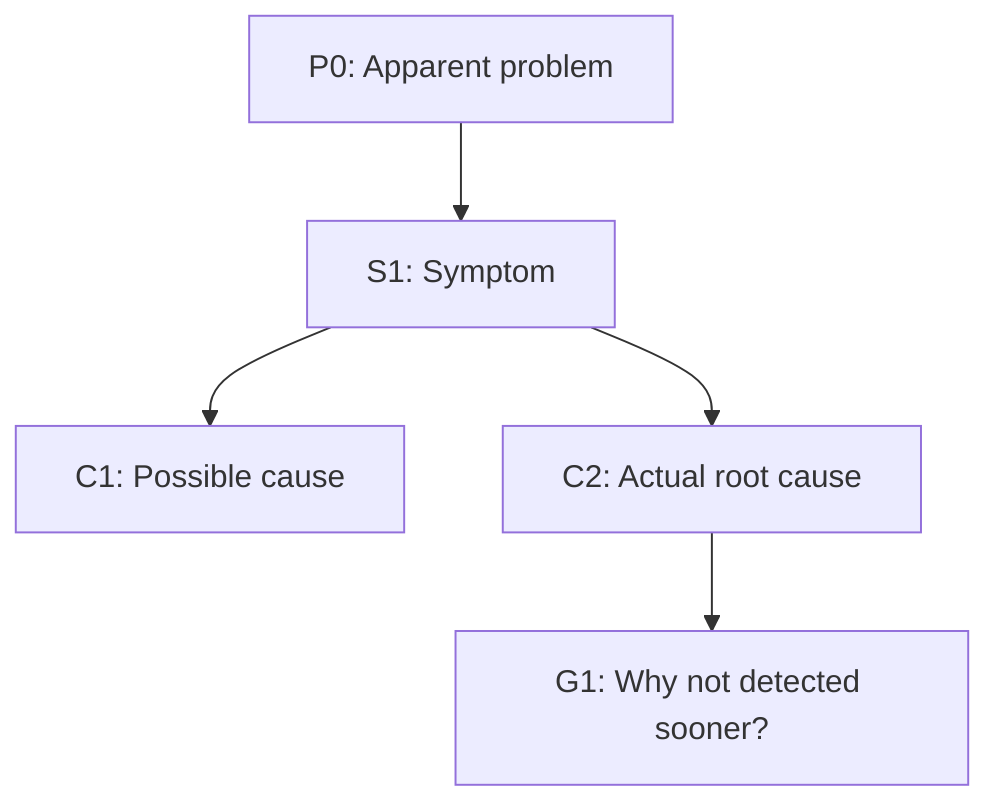

# RCA

## Overview

Run a rigorous, branch-aware root cause analysis starting from the apparent problem and drilling deeper with iterative "why" questions. Build a causal tree that captures symptoms, contributing factors, and possible/actual root causes, then produce an action-oriented RCA document.

## Workflow

1. Restate the apparent problem in one sentence.
2. Capture impact and scope:
   - What is failing?
   - Who is affected?
   - Since when?
   - How often?
   - How severe?
3. State known facts vs assumptions before asking deeper "why" questions.
4. Build an RCA tree:
   - Treat each symptom as a node.
   - Ask "why did this happen?" for that node.
   - Create child nodes for each plausible explanation.
   - Continue drilling until no deeper controllable cause is found or evidence is insufficient.
5. Go wide and deep:
   - Do not stop at the first plausible cause.
   - Explore parallel branches where multiple causes could coexist.
   - For each branch, ask both "why did it happen?" and "why was it not prevented/detected earlier?"
6. Mark every leaf as one of:
   - `actual root cause` (supported by evidence),
   - `possible root cause` (plausible but unverified),
   - `unknown` (insufficient evidence).
7. For every possible/actual root cause, define concrete actions to mitigate or remove the cause.
8. End with a final RCA document in Markdown including a diagram of the analysis tree.

## Questioning Rules

1. Ask targeted, evidence-seeking questions.
2. Ask one question at a time when interacting live with the user.
3. Prefer questions that disambiguate branches quickly:
   - What changed recently?
   - Why did safeguards not block this?
   - Why did monitoring not detect it sooner?
   - Why did process or review not catch it?
4. Distinguish:
   - proximate causes (immediate trigger),
   - contributing causes (amplifiers),
   - systemic causes (organizational/process gaps).
5. Keep drilling until each active branch reaches a defensible leaf with confidence noted.

## Branch Expansion Heuristics

Expand each branch using relevant dimensions:

- `Technical`: code defects, architecture, dependencies, config, infra, networking.
- `Data`: bad inputs, schema drift, migrations, stale/incorrect data.
- `Process`: change management, rollout, testing, review, incident response.
- `Detection`: monitoring gaps, alert tuning, observability blind spots.
- `Human/Org`: ownership ambiguity, handoff failures, staffing/load, training.
- `External`: third-party outages, vendor/API behavior, environmental constraints.

If a branch appears weak, either collect evidence to strengthen it or downgrade confidence.

## Evidence and Confidence

For each node, record:

- evidence source (logs, metrics, timeline, user report, code diff, interview),
- confidence (`high`, `medium`, `low`),
- status (`confirmed`, `hypothesis`, `unknown`).

Never present a hypothesis as confirmed without supporting evidence.

## Required Final Output

Generate a single Markdown document with this structure:

1. `# Root Cause Analysis: <problem>`
2. `## Problem Statement`
3. `## Impact and Scope`
4. `## Timeline (if known)`
5. `## Analysis Tree (Mermaid)`
6. `## Node Details` (node ID, statement, evidence, confidence, status)
7. `## Identified Root Causes`
8. `## Recommended Actions`
9. `## Open Questions and Next Evidence to Collect`

Include a Mermaid diagram representing the causal tree, for example:

In `## Recommended Actions`, provide one row per possible/actual root cause with:

- cause ID,
- action,
- action type (`containment`, `mitigation`, `corrective`, `preventive`),
- expected effect,
- priority (`P0`-`P3`),
- owner (if known),
- target date (if known),
- verification metric or test.

Do not finish until every leaf marked as possible/actual root cause has at least one proposed action.
