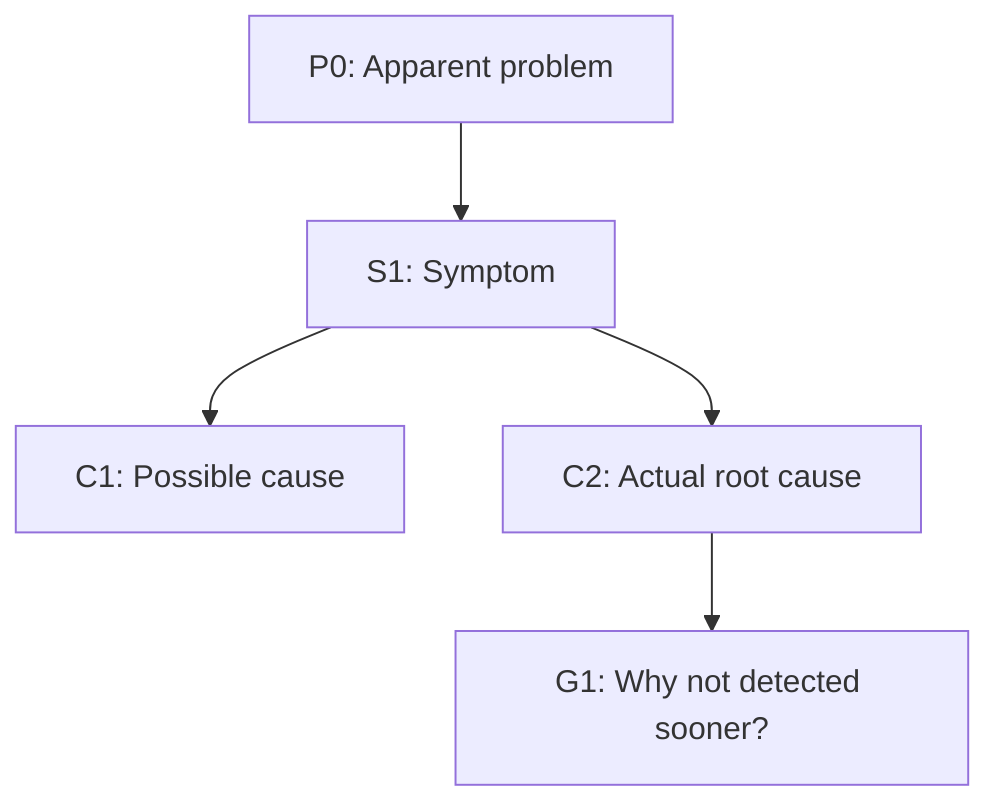

# RCA

## Overview

Run branch-aware root cause analysis from the apparent problem to defensible causes. Build a causal tree, classify each leaf by confidence, and end with concrete actions per possible/actual root cause.

## Core Rules

1. Ask targeted, evidence-seeking questions.
2. Ask one question at a time during live interaction.
3. Go wide and deep; never stop at the first plausible cause.
4. For each branch, ask both:
   - Why did this happen?
   - Why was it not prevented or detected earlier?
5. Separate facts from assumptions.
6. Never present hypotheses as confirmed without evidence.
7. Do not finish until each possible/actual root cause has at least one action.

## Workflow

1. Restate the apparent problem in one sentence.
2. Capture impact and scope: what failed, who was affected, when it started, frequency, severity.
3. Build a causal tree:
   - Treat each symptom as a node.
   - Ask "why?" and add child causes.
   - Continue until no deeper controllable cause is found or evidence is insufficient.
4. Label each leaf:
   - `actual root cause` (evidence-backed),
   - `possible root cause` (plausible, unverified),
   - `unknown` (insufficient evidence).
5. Distinguish cause types where useful: proximate, contributing, systemic.

## Branch Lenses

Use these lenses to expand weak branches:

- `Technical`: code defects, architecture, dependencies, config, infra, networking.
- `Data`: bad inputs, schema drift, migrations, stale/incorrect data.
- `Process`: change management, rollout, testing, review, incident response.
- `Detection`: monitoring gaps, alert tuning, observability blind spots.
- `Human/Org`: ownership ambiguity, handoff failures, staffing/load, training.
- `External`: third-party outages, vendor/API behavior, environmental constraints.

If a branch is weak, collect evidence or downgrade confidence.

## Evidence and Confidence

For each node, record:
- evidence source (logs, metrics, timeline, report, code diff, interview),
- confidence (`high`, `medium`, `low`),
- status (`confirmed`, `hypothesis`, `unknown`).

## Required Deliverable

Produce one Markdown RCA document with:

1. `# Root Cause Analysis: <problem>`
2. `## Problem Statement`
3. `## Impact and Scope`
4. `## Timeline (if known)`
5. `## Analysis Tree (Mermaid)`
6. `## Node Details` (node ID, statement, evidence, confidence, status)
7. `## Identified Root Causes`
8. `## Recommended Actions`
9. `## Open Questions and Next Evidence to Collect`

Include a Mermaid causal tree, for example:

In `## Recommended Actions`, provide one row per possible/actual root cause with:

- cause ID,
- action,
- action type (`containment`, `mitigation`, `corrective`, `preventive`),
- expected effect,
- priority (`P0`-`P3`),
- owner (if known),
- target date (if known),
- verification metric or test.
