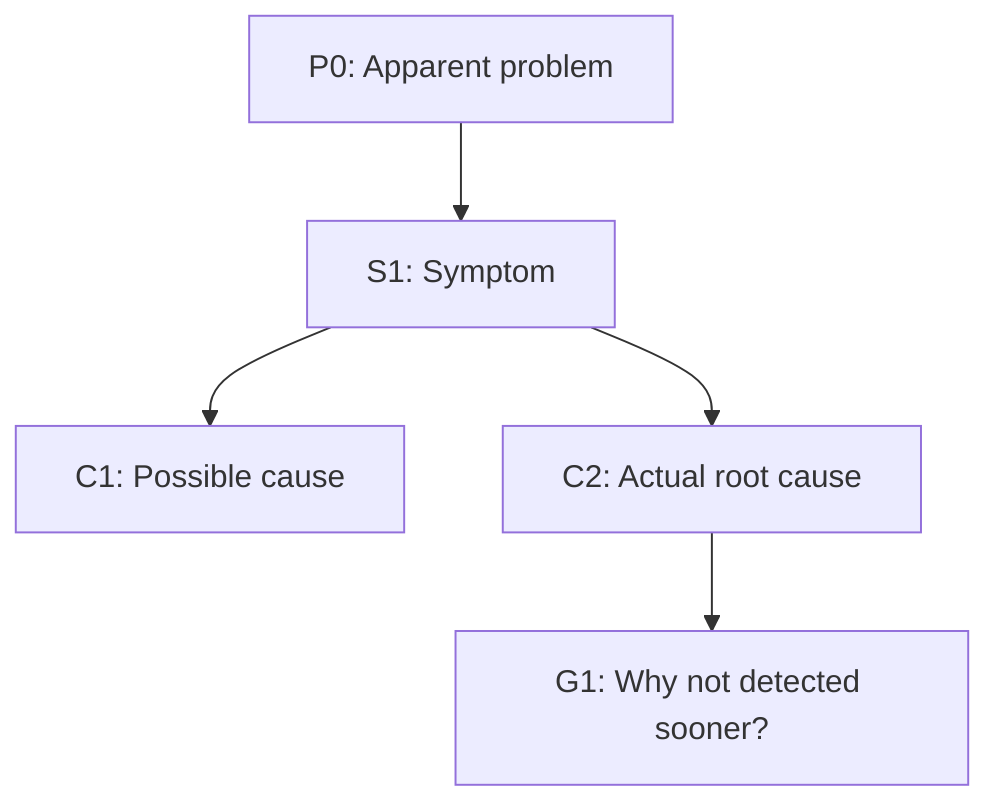

# RCA

## Purpose

Build a branch-aware causal tree from apparent problem to defensible root causes. Classify each leaf by confidence. Produce concrete actions per cause.

## Interaction Contract

1. Ask one question at a time during interview phases.
2. Keep the user informed when evidence changes branch direction.
3. Confirm assumptions before promoting hypotheses to conclusions.

## Core Rules

1. **Interview first. No exceptions.** Ask user questions to establish the baseline narrative before any codebase inspection. Do NOT open files, search code, or read logs until at least the five interview questions in Workflow §1 are answered.
2. **One question at a time.** Do not comment on, interpret, or editorialize answers — record and ask the next question.
3. **Questions follow the incident narrative** (what happened, why, what changed). Codebase observations can corroborate but must not hijack interview flow.
4. **Go wide and deep.** Never stop at the first plausible cause.
5. **Per branch, ask both:** *Why did this happen?* and *Why wasn't it prevented or detected earlier?*
6. **Separate facts from assumptions.** Never present a hypothesis as confirmed without evidence.
7. **Never assume a cause from partial answers** — ask instead.
8. **Do not finish** until every possible/actual root cause has at least one action.

## Workflow

### 1. Interview

Ask one question at a time. Cover at minimum:
- What is the apparent problem?
- What failed, who was affected, how severe?
- When did it start — is it ongoing or resolved?
- What evidence exists (logs, metrics, alerts, error messages, timelines)?
- What changed recently (deploys, config, data, dependencies)?

Do not read any files, logs, or code until all five questions above are answered. Never let codebase observations drive the questions.

### 2. Restate

Summarize the apparent problem in one sentence. Confirm with user if ambiguous.

### 3. Build Causal Tree

- Treat each symptom as a node.
- Ask "why?" recursively, adding child causes.
- Stop when no deeper controllable cause exists or evidence is insufficient.

### 4. Label Each Leaf

| Label | Meaning |
|---|---|
| `actual root cause` | Evidence-backed |
| `possible root cause` | Plausible, unverified |
| `unknown` | Insufficient evidence |

Distinguish cause types where useful: proximate, contributing, systemic.

### 5. Produce Document

See **Deliverable** section.

## Branch Lenses

Apply to expand weak branches:

| Lens | Examples |
|---|---|
| Technical | Code defects, architecture, dependencies, config, infra, networking |
| Data | Bad inputs, schema drift, migrations, stale/incorrect data |
| Process | Change management, rollout, testing, review, incident response |
| Detection | Monitoring gaps, alert tuning, observability blind spots |
| Human/Org | Ownership ambiguity, handoff failures, staffing/load, training |
| External | Third-party outages, vendor/API behavior, environmental constraints |

If a branch is weak, collect evidence or downgrade confidence.

## Evidence and Confidence

For each node record:

| Field | Values |
|---|---|
| Evidence source | logs, metrics, timeline, code diff, interview |
| Confidence | `high` / `medium` / `low` |
| Status | `confirmed` / `hypothesis` / `unknown` |

## Deliverable

One Markdown document with these sections:

1. `# Root Cause Analysis: <problem>`
2. `## Problem Statement`
3. `## Impact and Scope`
4. `## Timeline (if known)`
5. `## Analysis Tree` — Mermaid causal tree (example below)
6. `## Node Details` — node ID, statement, evidence, confidence, status
7. `## Identified Root Causes`
8. `## Recommended Actions` — one row per cause: ID, action, type, expected effect, priority (P0–P3), owner, target date, verification metric
9. `## Open Questions`

Action types: `containment` · `mitigation` · `corrective` · `preventive`

## Stop Condition

Stop when each root-cause branch is labeled (`actual root cause`, `possible root cause`, or `unknown`), each branch has at least one action, and remaining unknowns are listed in `## Open Questions`.
