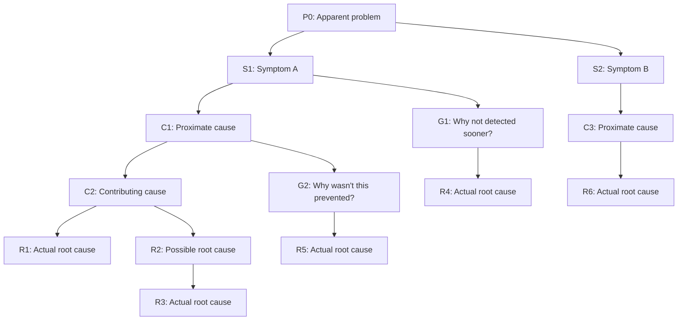

# RCA

## Purpose

Build a branch-aware causal tree from apparent problem to defensible root causes. Classify each leaf by confidence. Produce concrete actions per cause.

## Interaction Contract

1. Ask one question at a time during interview phases.
2. Keep the user informed when evidence changes branch direction.
3. Confirm assumptions before promoting hypotheses to conclusions.
4. If the user defers a question ("ask me later"), record the deferral, continue with the next question, and revisit before closing the interview phase.
5. If the user contributes their own Q&A pairs, incorporate them into the tree exactly as you would an answer to your own question. Do not re-ask what the user has already answered.

## Core Rules

1. **Interview first. No exceptions.** Ask user questions to establish the baseline narrative before any codebase inspection. Do NOT open files, search code, or read logs until at least the five interview questions in Workflow §1 are answered.
2. **One question at a time.** Do not comment on, interpret, or editorialize answers — record and ask the next question.
3. **Questions follow the incident narrative** (what happened, why, what changed). Codebase observations can corroborate but must not hijack interview flow.
4. **Go wide and deep.** Never stop at the first plausible cause.
5. **At every node, ask at least:** *Why did this happen?* and *Why wasn't it prevented or detected?* This applies to symptoms and causes alike — a contributing cause can itself raise a prevention or detection question that becomes its own branch.
6. **Separate facts from assumptions.** Never present a hypothesis as confirmed without evidence.
7. **Never assume a cause from partial answers** — ask instead.
8. **Do not finish** until every possible/actual root cause has at least one action and every open question has been resolved or explicitly deferred by the user.
9. **The causal tree is built through questions, not inference.** Do not reason your way to root causes internally and then produce the document. Every cause node must be validated or surfaced through a question to the user. After the initial interview you MUST conduct a full Probing round (Workflow §3) before generating any deliverable.
10. **Depth minimum.** Every significant branch must reach at least 3 levels of causality (symptom → proximate cause → contributing cause → root cause) or the user must explicitly confirm they cannot go deeper. A two-level tree is almost never complete.

## Workflow

### 1. Interview

Ask one question at a time. Cover at minimum:
- What is the apparent problem?
- What failed, who was affected, and how severe was it?
- When did it start — is it ongoing or resolved?
- What evidence exists (logs, metrics, alerts, error messages, timelines)?
- What changed recently (deploys, config, data, dependencies)?

Do not read any files, logs, or code until all five questions above are answered. Never let codebase observations drive the questions.

### 2. Restate

Summarize the apparent problem in one sentence. Confirm with user if ambiguous.

### 3. Probing (required — do not skip)

This phase extends the causal tree through active questioning. It is NOT internal reasoning. For each cause or symptom identified so far:

1. **Go deeper:** Ask "Why did this happen?" one level deeper than the current answer. Repeat until the user confirms they don't know or no deeper cause is controllable.
2. **Ask the prevention/detection question:** "Why wasn't this prevented or caught earlier?" for every significant node. This often opens a separate detection or process branch.
3. **Apply lenses:** For each branch, use the Branch Lenses table (§ below) to identify blind spots. If a lens hasn't been touched, ask one question to probe it.
4. **Challenge systemic patterns:** Ask whether similar incidents happened elsewhere (other services, teams, features). A confirmed second instance upgrades `possible` → `actual (systemic)`.

**Gate:** Before moving to §4, you must be able to confirm at least one of:
- Every branch has ≥3 causal levels, OR
- The user has explicitly stated they cannot go deeper on that branch.

Do not produce the deliverable until this gate is satisfied.

### 4. Build Causal Tree (synthesize)

After probing is complete, synthesize into the tree structure:

- Treat each symptom as a node.
- Add child causes from the probing answers.
- At **any node** — symptom or cause — ask both: *Why did this happen?* and *Why wasn't it prevented or detected?* Questions are not limited to the top level; a contributing cause can itself raise a question that becomes its own branch.
- Stop when no deeper controllable cause exists or evidence is insufficient.
- For any Process branch, ask: has a similar incident occurred in adjacent systems, features, or teams? A second confirmed instance upgrades a "possible" systemic root cause to "actual (systemic)".

### 5. Label Each Leaf

| Label | Meaning |
|---|---|
| `actual root cause` | Evidence-backed |
| `possible root cause` | Plausible, unverified |
| `unknown` | Insufficient evidence |

Distinguish cause types where useful: proximate, contributing, systemic.

### 6. Produce Document

See **Deliverable** section.

## Branch Lenses

Apply to expand weak branches:

| Lens | Examples |
|---|---|
| Technical | Code defects, architecture, dependencies, config, infra, networking |
| Data | Bad inputs, schema drift, migrations, stale/incorrect data |
| Process | Change management, rollout, testing, review, incident response, automation |
| Detection | Monitoring gaps, alert tuning, observability blind spots |
| Human/Org | Ownership ambiguity, handoff failures, staffing/load, training |
| External | Third-party outages, vendor/API behavior, environmental constraints |

If a branch is weak, collect evidence or downgrade confidence.

## Evidence and Confidence

For each node record:

| Field | Values |
|---|---|
| Evidence source | logs, metrics, timeline, code diff, interview |
| Confidence | `high` / `medium` / `low` |
| Status | `confirmed` / `hypothesis` / `unknown` |

## Deliverable

One Markdown document with these sections:

1. `# Root Cause Analysis: <problem>`
2. `## Problem Statement`
3. `## Impact and Scope`
4. `## Timeline (if known)`
5. `## Analysis Tree` — Mermaid causal tree (example below)
6. `## Node Details` — node ID, statement, evidence, confidence, status
7. `## Identified Root Causes`
8. `## Recommended Actions` — one row per cause: ID, action, type, expected effect, priority (P0–P3), owner, target date, verification metric
9. `## Open Questions` — only questions that are genuinely unresolvable or that the user explicitly said they cannot answer; never a holding area for questions not yet asked

```mermaid
flowchart TD
  P0["P0: Apparent problem"]

  P0 --> S1["S1: Symptom A"]
  P0 --> S2["S2: Symptom B"]

  S1 --> C1["C1: Proximate cause"]
  C1 --> C2["C2: Contributing cause"]
  C2 --> R1["R1: Actual root cause"]
  C2 --> R2["R2: Possible root cause"]
  R2 --> R3["R3: Actual root cause"]

  S1 --> G1["G1: Why not detected sooner?"]
  G1 --> R4["R4: Actual root cause"]

  C1 --> G2["G2: Why wasn't this prevented?"]
  G2 --> R5["R5: Actual root cause"]

  S2 --> C3["C3: Proximate cause"]
  C3 --> R6["R6: Actual root cause"]
```

Action types: `containment` · `mitigation` · `corrective` · `preventive`

## Stop Condition

Stop only when all four conditions are met:

1. The Probing gate (§3) has been satisfied — every branch has ≥3 causal levels OR the user confirmed they cannot go deeper.
2. Every root-cause branch is labeled (`actual root cause`, `possible root cause`, or `unknown`).
3. Every branch has at least one action.
4. Every open question has been resolved or the user mentioned explicitly they cannot answer it.

Do not stop while questions remain unanswered — continue the interview. `## Open Questions` is only for questions that are genuinely unresolvable (missing evidence, dependencies outside of your control) or that the user has explicitly deferred; it is not a place to park questions you have not yet asked.

## Continuing After the Deliverable

If the user opens a new line of inquiry after the document is produced, treat it as a new interview round:

- Ask follow-up questions one at a time as before.
- Add new nodes to the existing tree; revise labels if evidence changes.
- Extend the Recommended Actions table with any new causes.
- Re-emit the full updated document when the new round is complete.

The deliverable is a living document, not a final gate.
